# Purpose
This project comprises of three different parts:
1. Comparing several hash functions in a dictionary-based application in terms of value distribution. 
2. Writing a terminal application that can print a definition to a single word or convert a .txt file into an html page with the same text, but where definition pops up on mouse hover of each word.
3. Analyzing the performance of this application and optimizing it with the use of assembly.  

# Contents
- **[Comparing hash functions](#comparing-hash-functions)**
  - [1. Constant](#1-constant)
  - [2. String length](#2-string-length)
  - [3. First character](#3-first-character)
  - [4. Characters sum](#4-characters-sum)
  - [5. Xor and right rotate](#5-xor-and-right-rotate)
  - [6. Xor and left rotate](#6-xor-and-left-rotate)
  - [7. Murmur3](#7-murmur3-smirk_cat)
  - [8. CRC32](#8-crc32)
  - [Standard deviations](#standard-deviations)
  - [Execution time tests](#execution-time-tests)
    - [Result for -O0](#result-for--o0-nanoseconds)
    - [Result for -O3](#result-for--o3-nanoseconds)
  - [Conclusion]()
- **[Application](#application)**
  - [Chosen algorithm and HashTable size](#chosen-algorithm-and-hashtable-size)
    - [Load factor = 0.75](#load-factor--075)
    - [Load factor = 0.95](#load-factor--095)
  - [Functionality](#functionality)
    - [Giving definition to a single word](#giving-definition-to-a-single-word)
    - [Creating an html page from a txt document](#creating-an-html-page-from-a-txt-document)
- **[Optimization](#optimization)**
  - [Choosing testing strategy](#choosing-testing-strategy)
    - [Failed attempt #1](#failed-attempt-1)
    - [Failed attempt #2](#failed-attempt-2)
    - [Final testing program](#final-testing-program)
  - [Hash function optimization](#hash-function-optimization)

# Comparing hash functions
A shortened dictionary database has been used with the total number of words equal to 5608. For higher objectiveness 5 hash table sizes have been considered (521, 1031, 2053, 4099, 8209). The hash functions being compared are the following:

## 1. Constant 
### Definition
Simply `H(string) = 0`.

### HashTable size = 1031


Obviously, this <del>hash function</del> is not applicable to anything.

## 2. String length 
### Definition
`H(string) = length(string)`

### HashTable size = 1031
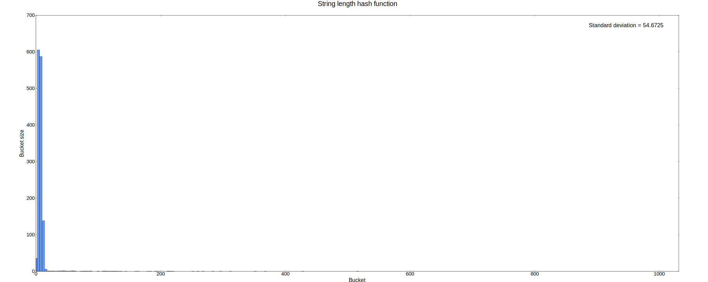

The flaw of this hash function is that most of the elements are concentrated in the first few buckets of the hash table. This is due to the fact that the average English word's length is 4.7 characters, and as the number of buckets increases the distribution remains the same.

## 3. First character 
### Definition
`H(string) = string[0]`

### HashTable size = 1031
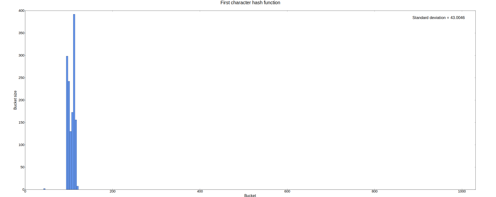

Almost the same as the previous one - the distribution doesn't change and no sign of homogeneity can be seen.

## 4. Characters sum 
### Definition
`H(string) = sum for i from 0 to length(string) - 1 of string[i]`

### HashTable size = 1031
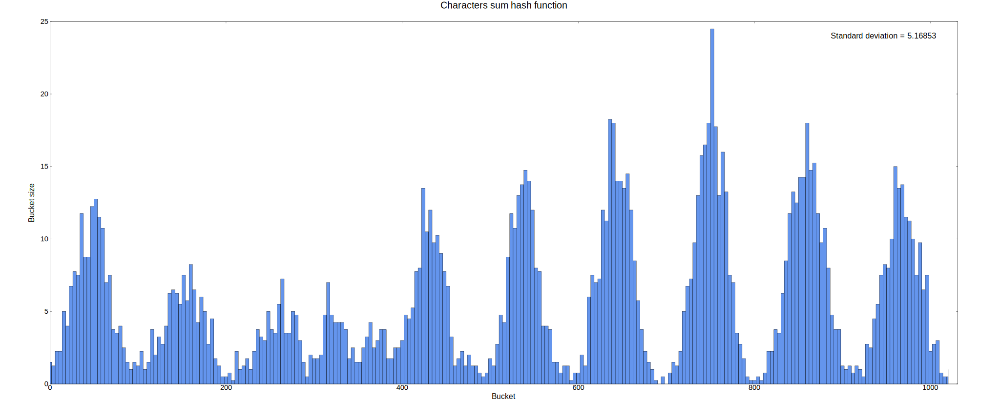

### HashTable size = 4099
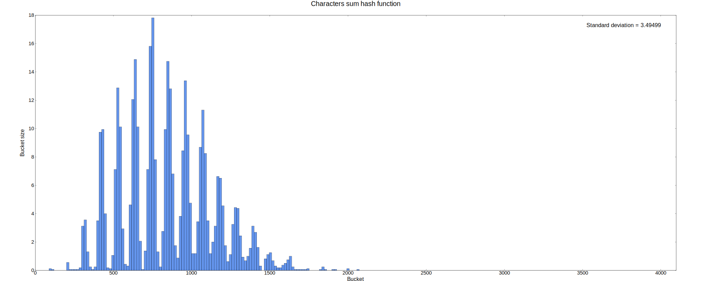

And again the distribution stays almost the same, though this time it's much better due to words with large hashes not going to the beginning because of being greater than the hash table's size. The range of elements convergence can be estimated as [97 * 4.7, 122 * 4.7] = [455.9, 573.4] (*97 - ASCII 'a', 122 - ASCII 'z' and 4.7 - average length of an English word*). The plot clearly shows a local peak in this interval, although there are others, the highest one being located at about [700, 800]. This can be explained by the fact that the dictionary database includes a plethora of long archaic words, which shift the distribution to the right.  

## 5. Xor and right rotate
### Definition
`H_0(string) = 0; H_i+1(string) = rightRotate(H_i(string)) xor string[i]`

### HashTable size = 1031
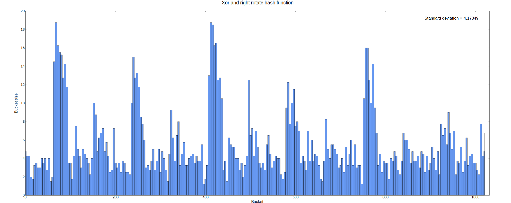

### HashTable size = 4099
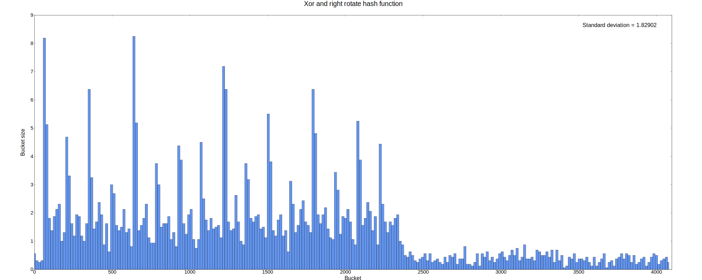

## 6. Xor and left rotate
### Definition
`H_0(string) = 0; H_i+1(string) = leftRotate(H_i(string)) xor string[i]`

### HashTable size = 1031
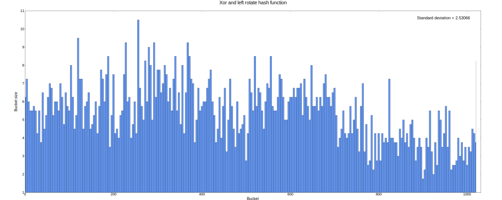

### HashTable size = 4099
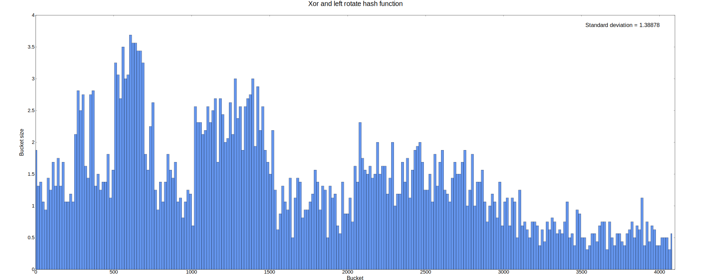

As can be seen from the diagrams, left rotation does a better job compared to right rotation. This can probably be explained by the nature of data we are analyzing the hash table on. Each byte is an ASCII character and less than 128. This means the most significant bit of each byte is 0. Let us consider an example: take the first character be 'k' or 107 in decimal or 01101011 in binary. For simplicity suppose the hash is 16 bit, not 32.

```
                             Not extended ASCII range
                               |=================|
15 14 13 12 11 10  9  8     7  6  5  4  3  2  1  0
-----------------------     ----------------------
 0  0  0  0  0  0  0  0     0  1  1  0  1  0  1  1    hash = 'k' 
                            ^
 1  0  0  0  0  0  0  0     0  0  1  1  0  1  0  1    rightRotate(hash, 1)
                            ^  
                        ...
 *  *  *  *  *  *  *  1     0  *  *  *  *  *  *  *
                            ^
```

During the first 8 iterations of the hash function, 7th bit is always 0, i.e. it doesn't influence the result hash at all which leads to a more uneven distribution than that of the left rotate. If we now look at it

```
                             Not extended ASCII range
                               |=================|
15 14 13 12 11 10  9  8     7  6  5  4  3  2  1  0
-----------------------     ----------------------
 0  0  0  0  0  0  0  0     0  1  1  0  1  0  1  1    hash = 'k' 
                            
 0  0  0  0  0  0  0  0     1  1  0  1  0  1  1  0    leftRotate(hash, 1)
```

it's clear that all 8 least significant bits influence the result. 
## 7. Murmur3 :smirk_cat:
### Definition
32-bit third version of [aappleby](https://github.com/aappleby)'s hash function. See [this](http://www.self.gutenberg.org/articles/MurmurHash) article for more information on the subject. 

### HashTable size = 1031
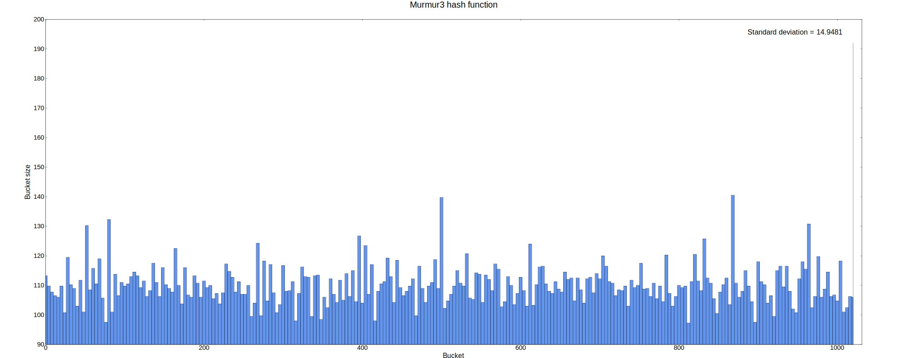

### HashTable size = 4099
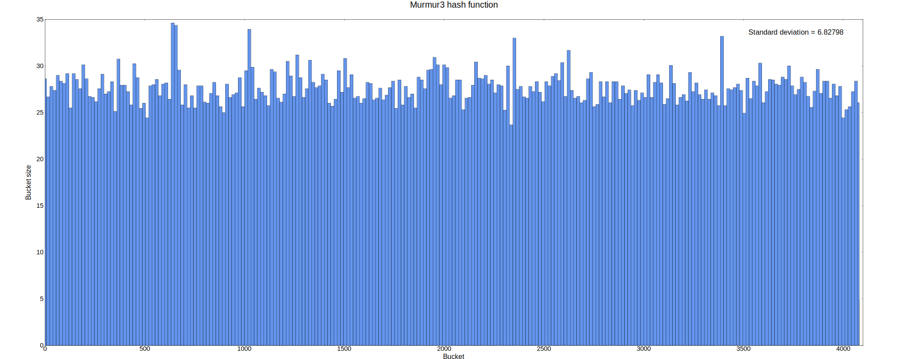

So far, this algorithm looks pretty solid - it produces an even distribution and has the lowest standard deviation.

## 8. CRC32
### Definition
Classical cyclic redundancy check algorithm that uses exclusive or operation, bitwise shifts as well as a lookup table. For more information, read [this](https://en.wikipedia.org/wiki/Cyclic_redundancy_check).

### HashTable size = 1031
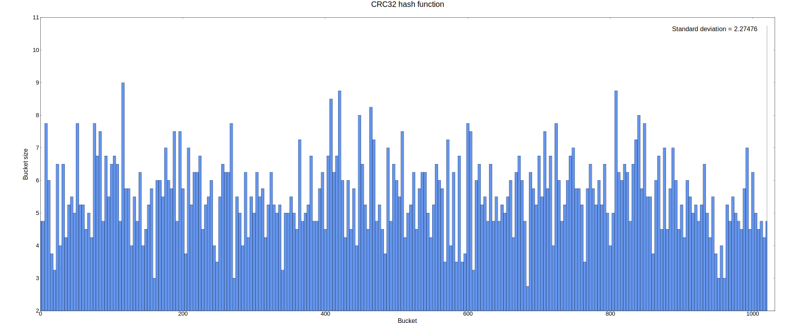

### HashTable size = 4099
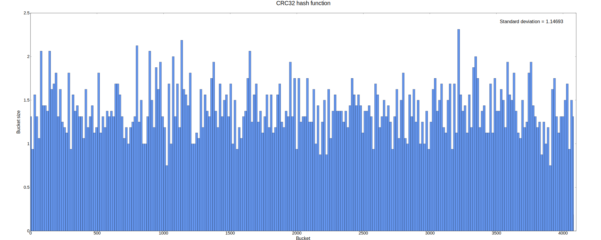

Unsurprisingly, this hashing algorithm has the best bucket distribution, which is expected for it involves significantly more operations and has been invented with multiple tests and research.

>More diagrams for sizes 521, 2053, 8209 as well as the shortened dictionary used can be found in "[bin/res/00_compare_hashes/](https://github.com/tralf-strues/mipt-2nd-semester-asm/tree/main/nasm-linux/hash-table/bin/res/00_compare_hashes)".

## Standard deviations 

Here are the standard deviations for all the tests:
Algorithm|521|1031|2053|4099|8209
---------|---|----|----|----|----
Constant|245.28|174.45|123.65|87.52|61.85
String length|76.54|54.67|38.84|27.52|19.46
First character|60.02|43.00|30.60|21.70|15.35
Characters sum|7.41|4.98|4.36|3.36|2.47
Xor and right rotate|8.20|4.18|2.28|1.74|1.25
Xor and left rotate|3.57|2.53|1.88|1.35|0.95
Murmur3|3.51|2.60|1.85|1.26|0.91
CRC32|3.16|2.30|1.63|1.15|0.83

CRC32, Murmur3 and the algorithm using exclusive or alongside left bitwise rotation have shown the best results.

## Execution time tests
Each hash function has been tested 10^9 times on the same strings of size 3, 5, 10, 15 and 255 and average execution time of each one is calculated for flags -O[0-3]. The strings are:
1. "*The*" (half average-length word)
2. "*Meow!*" (average-length word)
3. "*Witchcraft*" (double average-length word)
4. "*Conceptualizing*" (triple average-length word)
5. "*Evil is evil. Lesser, greater, middling, it's all the same. Proportions are negotiated, boundaries blurred. I'm not a pious hermit. I haven't done only good in my life. But if I'm to choose between one evil and another, then I prefer not to choose at all.*" (sentence)

Entire log of the tests is located in [speed_comparison.txt](https://github.com/tralf-strues/mipt-2nd-semester-asm/tree/main/nasm-linux/hash-table/bin/res/00_compare_hashes/speed_comparison.txt):
FIXME:
```
====Testing speed of hash functions -O0====
g++ -o bin/intermediates/00_compare_hashes/main_speed_tests.o -c src/00_compare_hashes/main_speed_tests.cpp -O0 -DNDEBUG -w
g++ -o bin/intermediates/hash_functions.o -c src/hash_functions.cpp -O0 -DNDEBUG -w
g++ -o bin/00_speed_tests.out -O0 bin/intermediates/00_compare_hashes/main_speed_tests.o bin/intermediates/hash_functions.o  

Testing constant hash
Sample 0 [3]:	2.24635 ns	(Half average-length word)
Sample 1 [5]:	1.77401 ns	(Average-length word)
Sample 2 [10]:	1.72516 ns	(Double average-length word)
Sample 3 [15]:	1.71477 ns	(Triple average-length word)
Sample 4 [255]:	1.71628 ns	(Sentence)

...

====Testing speed of hash functions -O3====
g++ -o bin/intermediates/00_compare_hashes/main_speed_tests.o -c src/00_compare_hashes/main_speed_tests.cpp -O3 -DNDEBUG -w
g++ -o bin/intermediates/hash_functions.o -c src/hash_functions.cpp -O3 -DNDEBUG -w
g++ -o bin/00_speed_tests.out -O3 bin/intermediates/00_compare_hashes/main_speed_tests.o bin/intermediates/hash_functions.o  

Testing constant hash
Sample 0 [3]:	1.27853 ns	(Half average-length word)
Sample 1 [5]:	1.2118 ns	(Average-length word)
Sample 2 [10]:	1.20717 ns	(Double average-length word)
Sample 3 [15]:	1.19389 ns	(Triple average-length word)
Sample 4 [255]:	1.19498 ns	(Sentence)

...

Testing xor left rotate hash
Sample 0 [3]:	7.02953 ns	(Half average-length word)
Sample 1 [5]:	9.87868 ns	(Average-length word)
Sample 2 [10]:	17.2935 ns	(Double average-length word)
Sample 3 [15]:	24.6277 ns	(Triple average-length word)
Sample 4 [255]:	382.953 ns	(Sentence)

Testing murmur3 hash
Sample 0 [3]:	4.69705 ns	(Half average-length word)
Sample 1 [5]:	5.07867 ns	(Average-length word)
Sample 2 [10]:	5.81174 ns	(Double average-length word)
Sample 3 [15]:	6.22499 ns	(Triple average-length word)
Sample 4 [255]:	72.6188 ns	(Sentence)

Testing crc32 hash
Sample 0 [3]:	3.30064 ns	(Half average-length word)
Sample 1 [5]:	4.28765 ns	(Average-length word)
Sample 2 [10]:	9.62293 ns	(Double average-length word)
Sample 3 [15]:	15.9525 ns	(Triple average-length word)
Sample 4 [255]:	506.83 ns	(Sentence)

Testing optimized crc32 hash
Sample 0 [3]:	2.62107 ns	(Half average-length word)
Sample 1 [5]:	3.73992 ns	(Average-length word)
Sample 2 [10]:	5.97254 ns	(Double average-length word)
Sample 3 [15]:	8.32176 ns	(Triple average-length word)
Sample 4 [255]:	166.021 ns	(Sentence)
```

>For more information on how the tests were carried out, see [main_speed_tests.cpp](https://github.com/tralf-strues/mipt-2nd-semester-asm/blob/main/nasm-linux/hash-table/src/00_compare_hashes/main_speed_tests.cpp) and [00_run.sh](https://github.com/tralf-strues/mipt-2nd-semester-asm/blob/main/nasm-linux/hash-table/00_run.sh).

### Result for -O0 (nanoseconds)
Algorithm           |3      |5      |10     |15     |255
--------------------|-------|-------|-------|-------|-------
Constant            |2.25   |1.77   |1.72   |1.71   |1.72    
String length       |3.81   |3.96   |3.75   |4.04   |7.25    
First character     |3.36   |3.33   |3.34   |3.33   |3.33    
Characters sum      |8.88   |13.29  |32.90  |35.16  |571.75    
Xor and right rotate|12.14  |18.87  |35.65  |52.24  |875.86    
Xor and left rotate |12.86  |19.40  |36.14  |52.76  |858.10    
Murmur3             |14.38  |19.32  |24.45  |30.59  |386.84
CRC32               |8.69   |12.51  |25.07  |38.84  |835.02
CRC32 optimized     |4.04   |4.48   |6.41   |8.59   |166.31

### Result for -O3 (nanoseconds)
Algorithm           |3      |5      |10     |15     |255
--------------------|-------|-------|-------|-------|-------
Constant            |1.28   |1.21   |1.21   |1.19   |1.19
String length       |4.07   |3.19   |3.42   |3.11   |5.97
First character     |2.36   |2.33   |2.37   |2.35   |2.37
Characters sum      |6.60   |9.57   |16.82  |24.10  |379.96
Xor and right rotate|7.07   |10.51  |19.04  |27.58  |442.25
Xor and left rotate |7.03   |9.88   |17.29  |24.63  |382.95
Murmur3             |4.70   |5.08   |5.81   |6.22   |72.62
CRC32               |3.30   |4.29   |9.62   |15.95  |506.83
CRC32 optimized     |2.62   |3.74   |5.97   |8.32   |166.02

>CRC32 optimized is discussed later. 

## Conclusion
Clearly, the winners seem to be Murmur3 and CRC32 for they have the best distribution results and execution times. And even though Murmur3 shows itself best for longer strings (due to it performing operations on four bytes at a time), on shorter ones it sometimes runs even slower than CRC32.

# Application
## Chosen algorithm and HashTable size 
The full dictionary contains 121199 words. Below are the tests for [load factors](https://en.wikipedia.org/wiki/Hash_table#Key_statistics) equal to 0.75 and 0.95.

>size1 = 121,199 / 0.75 = 161,598.67 or 161,599 (the nearest prime number to it)\
>size2 = 121,199 / 0.95 = 127,577.89 or 127,579 (the nearest prime number to it)

### Load factor = 0.75

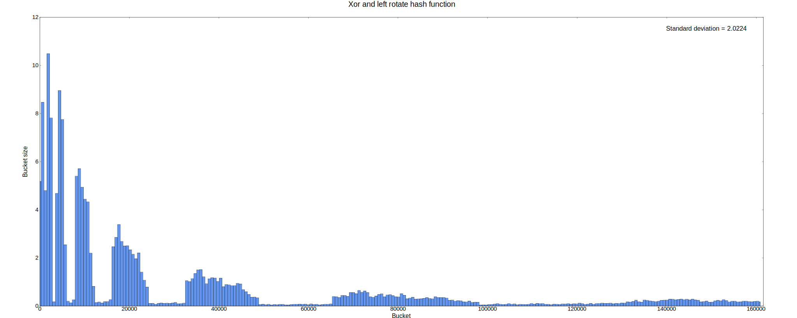
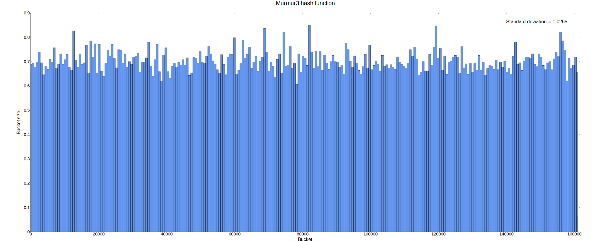
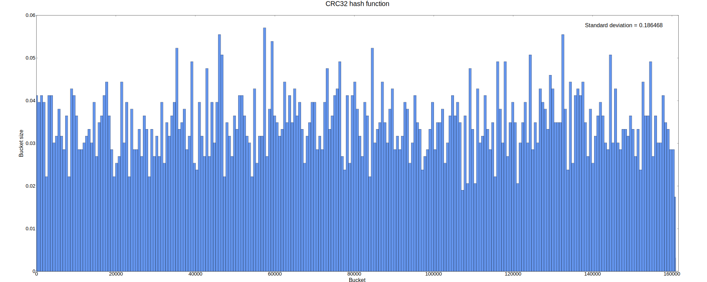

### Load factor = 0.95

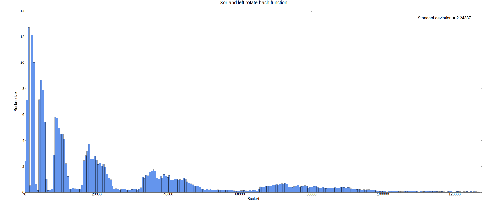
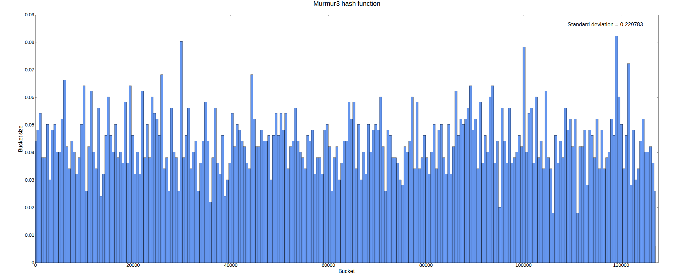
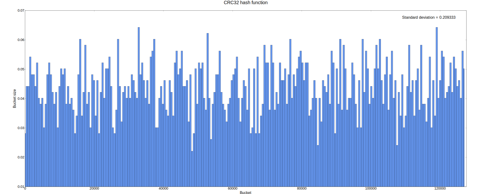

Left rotate algorithm shows itself quite badly here. In addition, the difference between load factors isn't that drastic for Murmur3 and CRC32, so 0.95 has been chosen in order to save some memory with almost none performance cost. 

Choosing between Murmur3 and CRC32 is a bit trickier. Even though the latter runs slower for long strings, the first one has only slightly worse standard deviation, and worse performance with optimization levels starting from 1 for short strings. Due to the fact that the Hash Table is used for a dictionary with words ranging from 4 to 10 letters on average, and CRC32 having a built-in hardware implementation by Intel as will be shown in the [optimization](#optimization) part, I have chosen CRC32.

## Functionality
Help message looks like the following
```
[Help]
These are commands for define:
  -h, --help   [show this message]
  -w, --word   [define just one word]
  -d, --doc    [specify input document]
  -o, --output [specify output file]
```
As can be seen the program supports two different modes:

### Giving definition to a single word
Example input
```
$ ./define.out -w Surprise
```
Example output
```
Definitions for 'surprise'
1. [n] The act of coming upon, or taking, unawares; the act of seizing unexpectedly; surprisal; as, the fort was taken by surprise.
2. [n] The state of being surprised, or taken unawares, by some act or event which could not reasonably be foreseen; emotion excited by what is sudden and strange; a suddenly excited feeling of wonder or astonishment.
3. [n] Anything that causes such a state or emotion.
4. [n] A dish covered with a crust of raised paste, but with no other contents.
```

### Creating an html page from a txt document 
The idea is you can hover over words and see their definitions. For example if we consider the first chapter (taken from [here](https://genius.com/J-r-r-tolkien-the-hobbit-chap-1-an-unexpected-party-annotated)) of J.R.R. Tolkien's [Hobbit](https://en.wikipedia.org/wiki/The_Hobbit), then the result will be something like this (note that there might be visual differences in different web browsers):
```
$ ./define.out --doc hobbit_chapter1.txt -o hobbit_chapter1.html
```
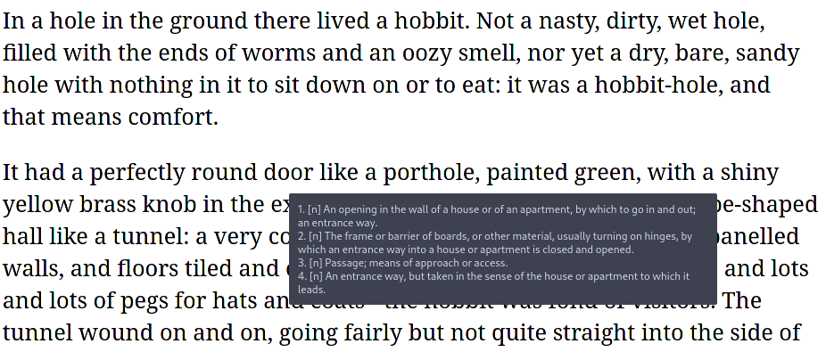

The word hovered on is 'door'.

# Optimization
First it is important to choose the way we test performance of the hash table.

## Choosing testing strategy
### Failed attempt #1
Let's first try to analyze performance of the program on a txt file containing books "Harry Potter and the Chamber of Secrets", "Harry Potter and the Goblet of Fire", "Harry Potter and the Half-blood Prince", "Harry Potter and the Deathly Hallows" (30,684 lines and 2,646,069 characters total).

Let's look at the profiler

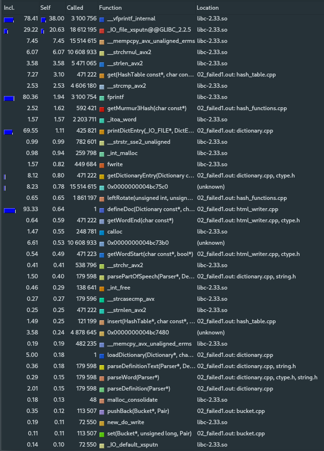

It's clear that the majority of CPU time is taken by I/O functions, which makes the test not objective. 

### Failed attempt #2
Here I have removed writing to output file.

Let's look at the profiler

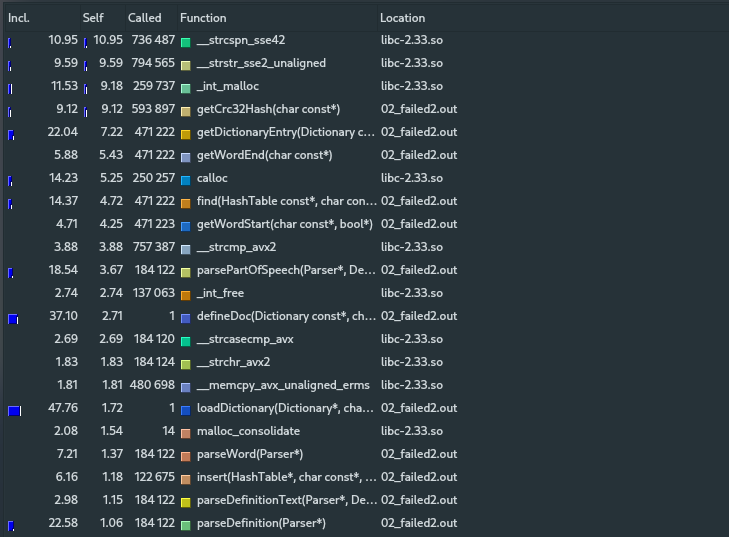

Still there are functions at the top which aren't related to the Hash Table.

### Final testing program
In order to minimize the time required by loading and parsing input file, I have found a [file](https://github.com/dwyl/english-words) containing just 466,472 words (with no definitions whatsoever). The test comprises of FIXME:5 insertions of all the words into the hash table and FIXME:150 searches of all of them. Let's look at the profiler

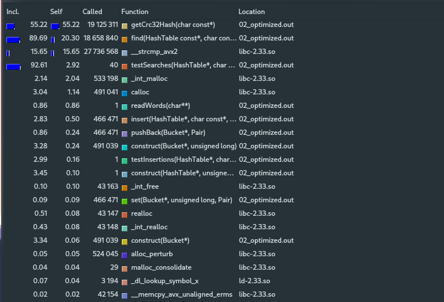

This is much better! Now we can start optimizing the Hash Table.

## Hash function optimization
Clearly the hash function takes most of the time, so it's worth the effort to decrease its execution time.

### Code FIXME:
GCC 
```
g++ -S -DNDEBUG -O1 -masm=intel hash_functions.cpp -o hash_functions.s
```
produces the following assembly listing for `getCrc32Hash()`:

```asm
_Z12getCrc32HashPKc:
.LFB47:
	.cfi_startproc
	movzx	eax, BYTE PTR [rdi]
	test	al, al
	je	.L38
	mov	edx, 0
	lea	rsi, _ZL11CRC32_TABLE[rip]
.L37:
	mov	ecx, edx
	sal	ecx, 8
	shr	edx, 24
	xor	eax, edx
	movzx	eax, al
	xor	ecx, DWORD PTR [rsi+rax*4]
	mov	edx, ecx
	add	rdi, 1
	movzx	eax, BYTE PTR [rdi]
	test	al, al
	jne	.L37
.L35:
	mov	eax, edx
	ret
.L38:
	mov	edx, 0
	jmp	.L35
	.cfi_endproc
```
As have already be mentioned, there is a built-in assembly crc32 instruction (read [this paper by Intel](https://www.intel.com/content/dam/www/public/us/en/documents/white-papers/crc-iscsi-polynomial-crc32-instruction-paper.pdf) on the subject for more information). To incorporate it to my C code I used inline assembly (see [gnu documentation](https://gcc.gnu.org/onlinedocs/gcc/Extended-Asm.html)):
```c++
uint32_t getOPCrc32Hash(const char* string)
{
    uint32_t hash = 0;

    __asm__ 
    (
        ".intel_syntax noprefix          \n\t"
        "xor rax, rax                    \n\t"
        "xor r12, r12                    \n\t"
        "                                \n\t"
        ".LOOP_CRC32:                    \n\t"
        "       mov r12b, BYTE PTR [rdi] \n\t"
        "       test r12b, r12b          \n\t"
        "       jz .LOOP_CRC32_END       \n\t"
        "                                \n\t"
        "       crc32 rax, r12b          \n\t"
        "                                \n\t"
        "       inc rdi                  \n\t"
        "       jmp .LOOP_CRC32          \n\t"
        ".LOOP_CRC32_END:                \n\t"
        ".att_syntax                     \n\t"

        :"=a"(hash)
        :
        :"r12", "rdi"
    );
    
    return hash;
}
```

### Performance boost
This has improved overall performance quite significantly even with -O3. File [optimization_tests.txt](bin/res/02_optimize/optimization_tests.txt) contains comparison tests for the two versions and optimization flags -O0 through -O3 (in addition, it has tests of the next optimization). Also note that each version of the program has been tested 3 times to get a more precise average time.
```
optimization_tests.txt:

TODO:
```

Version         |  -O0  |  -O1  |  -O2  |  -O3  
----------------|-------|-------|-------|-------
Not optimized   |       |       |       |        
CRC32 optimized |       |       |       |  
> Average time is given in seconds.

So we have increased performance by
FIXME:
- -O0: 1.2
- -O1: 1.2
- -O2: 1.2
- -O3: 1.2

### Functions time distribution
And now generated program's profile looks like the following:
FIXME:
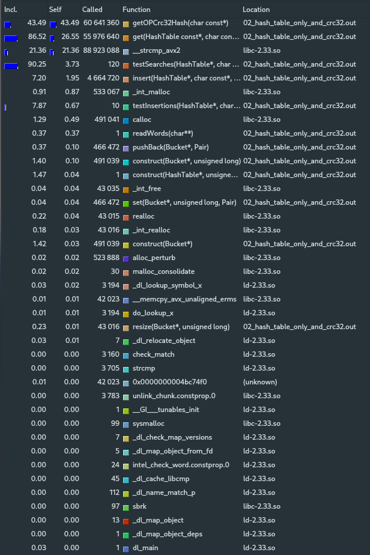

Hash function now has a lesser percentage of the total execution time. 

## Optimizing HashTable's find() function 
The second most time-cost function is HashTable's find().

### Code FIXME:
GCC
```
g++ -S -DNDEBUG -O1 -masm=intel hash_table.cpp -o hash_table.s
```
produces the following assembly listing for find():
```asm
_Z4findPK9HashTablePKc:
.LFB51:
	.cfi_startproc
	push	r14
	.cfi_def_cfa_offset 16
	.cfi_offset 14, -16
	push	r13
	.cfi_def_cfa_offset 24
	.cfi_offset 13, -24
	push	r12
	.cfi_def_cfa_offset 32
	.cfi_offset 12, -32
	push	rbp
	.cfi_def_cfa_offset 40
	.cfi_offset 6, -40
	push	rbx
	.cfi_def_cfa_offset 48
	.cfi_offset 3, -48
	mov	r13, rdi
	mov	r14, rsi
	mov	rdi, rsi
	call	[QWORD PTR 24[r13]]
	mov	eax, eax
	mov	edx, 0
	div	QWORD PTR 0[r13]
	lea	rdx, [rdx+rdx*2]
	mov	rax, QWORD PTR 8[r13]
	lea	r12, [rax+rdx*8]
	cmp	QWORD PTR 8[r12], 0
	je	.L24
	mov	ebp, 0
	mov	eax, 0
.L23:
	sal	rax, 5
	mov	rbx, rax
	mov	rax, QWORD PTR [r12]
	mov	rsi, QWORD PTR [rax+rbx]
	mov	rdi, r14
	call	[QWORD PTR 16[r13]]
	test	eax, eax
	je	.L27
	add	ebp, 1
	mov	eax, ebp
	cmp	rax, QWORD PTR 8[r12]
	jb	.L23
	mov	eax, 0
	jmp	.L20
.L27:
	mov	rax, rbx
	add	rax, QWORD PTR [r12]
	add	rax, 8
.L20:
	pop	rbx
	.cfi_remember_state
	.cfi_def_cfa_offset 40
	pop	rbp
	.cfi_def_cfa_offset 32
	pop	r12
	.cfi_def_cfa_offset 24
	pop	r13
	.cfi_def_cfa_offset 16
	pop	r14
	.cfi_def_cfa_offset 8
	ret
.L24:
	.cfi_restore_state
	mov	eax, 0
	jmp	.L20
	.cfi_endproc
```
The code seems to have too many memory accessing instructions (including stack usage). So by rewriting the function in assembly completely, I managed to improve performance.

```asm
.globl _Z4findPK9HashTablePKc
.type _Z4findPK9HashTablePKc, @function
.intel_syntax noprefix

# ------------------------------------------------------------------------------
# Finds an element associated with key in hashTable.
# 
# Expects: RDI = constant pointer to a HashTable
#          RSI = constant pointer to a string (key) 
# 
# Returns: RAX = constant pointer to value (DictEntry) or nullptr if there is 
#          no element with key in hashTable.
# ------------------------------------------------------------------------------
_Z4findPK9HashTablePKc:
                push r12 
                push rbx 

                mov rbx, rdi                    # rbx = hashTable
                
                mov rdi, rsi
                call QWORD PTR [rbx + 24]       # rax = getHash(key)

                xor rdx, rdx
                div QWORD PTR [rbx]             # rdx = rdx:rax % hashTable->size = hash

                mov rax, QWORD PTR [rbx + 8]    # rax = buckets
                
                # sizeof(Bucket) = 24
                lea rdx, [rdx + 2 * rdx]     
                lea rdx, [rax + 8 * rdx]        # &(buckets[hash])
                
                mov r12, QWORD PTR [rbx + 16]   # r12 = cmp
                mov rbx, QWORD PTR [rdx]        # rbx = buckets[hash].data
                mov rcx, QWORD PTR [rdx + 8]    # rcx = buckets[hash].size
                
                # rcx = rbx + 32 * rcx (sizeof(Pair)) = last + 1 bucket
                lea rcx, [4 * rcx]           
                lea rcx, [rbx + 8 * rcx]     

.LOOP_FIND_PAIR:
                cmp rbx, rcx 
                jae .NOT_FOUND_PAIR

                mov rdi, QWORD PTR [rbx]
                call r12

                test eax, eax 
                jz .FOUND_PAIR

                add rbx, 32
                
                jmp .LOOP_FIND_PAIR
.FOUND_PAIR:
                lea rax, [rbx + 8]
                pop rbx
                pop r12
                ret
.NOT_FOUND_PAIR:
                xor rax, rax
                pop rbx
                pop r12
                ret
```

### Performance boost
Surprisingly, I managed to outperform even -O3's code again. 
```
optimization_tests.txt:

TODO:
```

Version                  |  -O0  |  -O1  |  -O2  |  -O3  
-------------------------|-------|-------|-------|-------
Not optimized            |       |       |       |        
CRC32 optimized          |       |       |       |  
CRC32 + find() optimized |       |       |       |  
> Average time is given in seconds.

So we have increased performance (compared to the version CRC32 optimized) by
FIXME:
- -O0: 1.2
- -O1: 1.2
- -O2: 1.2
- -O3: 1.2
  
### Functions time distribution
And now program's profile looks like the following:
FIXME:
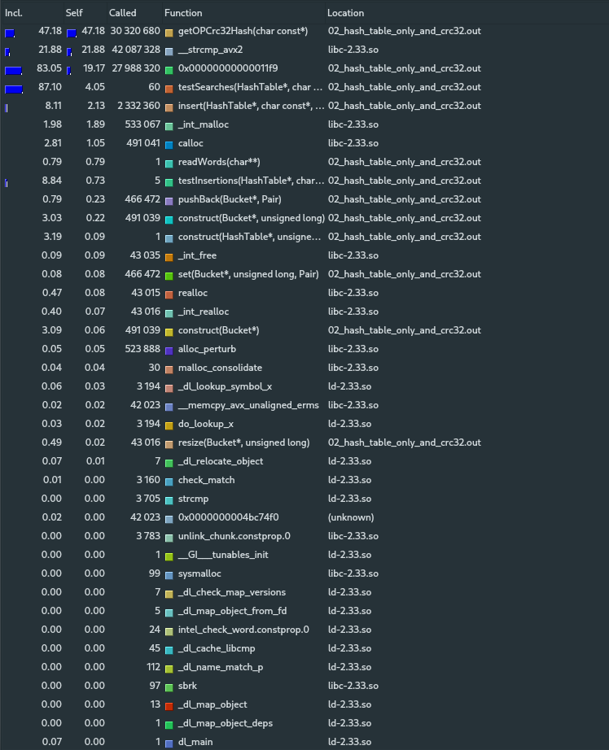 

## Using YMM registers to store strings
The last function that takes up the majority of computing time is `strcmp()`. Clearly, `strcmp_avx2()` (which you can see on the previous diagrams) is already optimized compared to a straightforward implementation of `strcmp()`. So it seems, there's nothing one can do in this situation... 

But, keeping in mind that we store English words in the hash table, we can benefit from the length of words being comparatively small. Having looked at the dictionary, I found out that there are no words longer or equal to 32 characters. This is why we can simply use YMM registers (introduced with [AVX](https://en.wikipedia.org/wiki/Advanced_Vector_Extensions)) to store words! Comparing words would be much faster this way.
